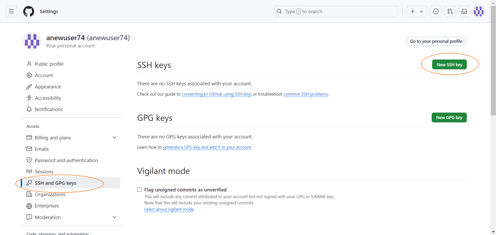

# Lab 0: Booting

负责助教：唐傑伟 徐厚泽

本学期，我们将实现一个简单的操作系统内核。在 Lab 0 中，我们将配置好实验环境并完成 3 个实验任务。

## 1. 服务器操作

### 连接服务器

```shell
ssh root@10.176.34.210 -p 你的端口号
```

考虑到项目文件数目较多，我们推荐使用 [VS Code 的 Remote 插件](https://code.visualstudio.com/docs/remote/ssh) 进行远程开发。

### 服务器概况

容器内有两个特殊的目录（挂载点）：

* `/share` 目录只读，供所有同学共享，其中放置一些共享文件。
* `~/data` 目录可读写，挂载了一块4.4T的硬盘，建议在该目录下存储实验所用到的文件。

CPU、内存和硬盘资源所有同学共享，无使用配额，请注意合理使用资源。

## 2. 配置代码仓库

### 在服务器上生成 SSH 密钥对

```sh
# 在终端输入，替换自己的邮箱地址
ssh-keygen -t rsa -b 4096 -C "your_email@example.com" 
​
# 按照提示连续按三次回车，即可生成ssh密钥
cat ~/.ssh/id_rsa.pub
# 观察到输出为：ssh-rsa xxxxxxxxxxxxxxx = xxxxx@xxxx.xx 即正确
```

### 在 Github 上配置 SSH 公钥

1. 复制 `cat ~/.ssh/id_rsa.pub` 输出的结果（即公钥）。
2. 打开 Github 并登录自己的账号。
3. 点击右上角头像，进入 Settings ：

    

4. 进入页面后，在左侧选择 `SSH and GPG keys`, 在右侧点击 `New SSH Key`。

    

5. 在框中粘贴入自己复制的公钥，点击 Add SSH key 即可。

### 使用 SSH 克隆仓库

```shell
cd ~/data

# SSH克隆代码仓库（HTTPS克隆不稳定）
git clone git@github.com:FDUCSLG/OS-25Fall-FDU.git
```

> [!info]
>
> 如果出现报错：（成功克隆则进入下一步）
>
> ```shell
> Cloning into 'OS-25Fall-FDU'...
> git@github.com: Permission denied (publickey).
> fatal: Could not read from remote repository.
> Please make sure you have the correct access rights
> and the repository exists.
> ```
>
> 请检查前两步：在服务器上生成 SSH 和在 Github 上配置 SSH 是否正确完成。

### 进入仓库，开始实验

```sh
cd OS-25Fall-FDU

# 切换到本实验分支
git checkout lab0

# 新建一个dev分支
git checkout -b lab0-dev

# 创建build目录用来构建运行内核
mkdir -p build
cd build
cmake ..
```

之后每次构建运行内核只要在 `build` 目录下 `cmake .. && make qemu` 。

### 更新代码仓库

本次实验中无需执行此部分，后续新实验发布后可参考此处更新代码仓库。

```shell
# 拉取远端仓库
git fetch --all

# 提交你的更改
git add .
git commit -m "your commit message"

# 切换到新lab的分支
git checkout lab2

# 新建一个分支，用于开发
git checkout -b lab2-dev

# 引入你在上个lab的更改
git merge lab1-dev
```

如果合并发生冲突，请参考错误信息自行解决。

## 3. QEMU

本学期的实验将在 QEMU 模拟的 [virt 通用虚拟平台](https://www.qemu.org/docs/master/system/arm/virt.html) 上运行我们编写的内核。我们已经为大家配置好了 QEMU，运行内核只需在 `build` 目录下输入 `make qemu` 。

> [!info]
>
> **QEMU 命令解析（不要求掌握）**
>
> 本学期实验所用的 QEMU 命令如下：
>
> ```shell
> qemu-system-aarch64 -machine virt,gic-version=3 \
>     -cpu cortex-a72 \
>     -smp 4 \
>     -m 4096 \
>     -nographic \
>     -monitor none \
>     -serial mon:stdio \
>     -global virtio-mmio.force-legacy=false \
>     -kernel kernel8.elf\ 
> ```
>
> * `-machine virt,gic-version=3` 指定模拟的机器类型为 `virt`（QEMU 中用于模拟虚拟的 ARM 系统的标准平台）。 `gic-version=3` 指定要使用的全局中断控制器 (GIC) 的版本为 3，用于支持更现代的中断处理功能。
> * `-cpu cortex-a72` 指定模拟的 CPU 类型为 Cortex-A72（一款高性能的 ARMv8 处理器）。
> * `-smp 4` 表示要模拟 4 个 CPU 核心（即 4 个对称多处理单元），后续我们的实验将涉及 SMP 的内容。
> * `-nographic` 配置 QEMU 运行在无图形输出模式下，即所有的输入输出都通过命令行界面进行，而不是通过 GUI 窗口。
> * `-monitor none` 禁用 QEMU 的监控控制台（QEMU monitor），避免了干扰正常的输出流。
> * `-serial mon:stdio` 将虚拟机的串行端口绑定到标准输入输出（stdio），这意味着虚拟机的输出会显示在当前的终端窗口中，输入也来自终端。
> * `-global virtio-mmio.force-legacy=false` 配置 QEMU 中的 VirtIO 设备（VirtIO 是一种用于加速虚拟化设备的标准）。`virtio-mmio.force-legacy=false` 禁用 VirtIO MMIO 设备的传统模式，确保这些设备使用现代化的接口。
> * `-kernel kernel8.elf` 指定要加载的内核镜像文件 `kernel8.elf`。QEMU 会在虚拟机中启动这个内核，模拟其运行环境。


**`qemu` 的退出方法为： `Ctrl+A`，松开后按 `x`。**

## 4. AArch64

> AArch64 等价于 ARMv8 的 64 位指令集。

本学期的教学 OS 将运行在 AArch64 架构下。

绝大多数代码都使用 C 语言完成，部分代码需要使用汇编语言编写，建议简要了解（当然暂时用不到）：

* 指令手册：[Arm Architecture Reference Manual for A-profile architecture](https://developer.arm.com/documentation/ddi0487/latest/)。
* 各通用寄存器及其别名、函数调用约定、栈结构。
* 算术、访存、跳转等基本汇编指令。

## 5. 操作系统

本课程的先修课程包括但不限于**程序设计**，**计算机系统基础**，**计算机组成与体系结构**。

* **程序设计**中，我们学习了用 C 语言编写**用户态**程序。**用户态**这一概念是相较于操作系统的**内核态**而言的，本课程实验的重心即为内核态编程。在后续的实验中，我们将逐步理解（1）用户态/内核态的定义；（2）划分用户态/内核态的意义；（3）用户态与内核态的交互等问题。
* **计算机系统基础**与 **计算机组成与体系结构**中，我们初步认识了计算机系统中的各类硬件组成，如 CPU，内存，缓存，外设等等。操作系统内核的作用在于**管理并虚拟化（或者说抽象）这些资源** \[1]。在后续的实验中，我们将逐步理解虚拟化这一概念。
* 除此以外，一系列软件开发实践中的重要问题，如并发和持久化，也将由操作系统中的特定的机制或策略解决。

换而言之，操作系统是「硬件资源」与「用户态程序」的中间层，负责管理用户态程序对于硬件资源的访问（随着学习的深入，我们将对这一命题做出补充）。

## 6. Booting

在 `build` 目录中执行 `make qemu` 后，构建系统将自动编译操作系统内核并启动 QEMU 运行内核。下面我们将介绍本实验操作系统内核的启动流程。

### 入口：梦开始的地方

我们通过链接器脚本（请见第7节）指定内核的入口为 `_start (src/start.S:28)` 函数。

> [!note]
>
> **为什么入口函数不是 `main` 函数？**
>
> 在学习用户态 C 语言编程时，我们认为 `main` 函数是程序的入口。然而，这一说法省略了编译层面的一些重要细节，编译器会在 `main` 函数插入一系列初始化代码，因而 `main` 函数不是函数严格意义上的入口（相关背景知识请自行回顾**计算机系统基础**）。同样，尽管我们的内核定义了 `main` 函数，我们仍需要将入口设为 `_start` 函数并完成一些必要的准备动作。
>
> 目前，我们无需深究 `_start` 函数中的细节，具体内容我们会在合适的时机提供解读文档。

### `main`：内核，启动！

`_start` 函数最终会跳转到 `main` 函数。在 `main` 函数中，我们将完成内核的初始化工作。至此，我们已经成功启动了我们的内核。

目前，`main` 函数中的主要内容是一个分支判断，其作用是区分 CPU 0 和其余核心的初始化逻辑。下面我们具体介绍之。

### 对称多处理器（SMP）

现代计算机广泛采用多处理器架构，感兴趣的同学可以通过 `lscpu` 命令查看我们服务器的处理器信息。同样地，我们的内核运行在 QEMU 虚拟出来的 4 核机器上。这 4 个核心可以并发（或者说并行，在这里我们暂不严格区分这两个概念）地执行不同的指令流。

> [!warning]
>
> **注意**：以下内容可能理解难度较高，因此为了完成实验任务，请着重注意加粗字体。此外，欢迎在 Github Issues 区提出问题。随着本课程实验的进行，同学们将逐步加深对这些问题的理解。

在我们的实验平台上，机器启动时仅有一个核（CPU 0）处于唤醒状态。作为唯一一个唤醒的核心，其主要负责：

* 内核相关服务的初始化，例如 `uart_init` 用于初始化通信串口，UART 可用于输出数据，前面我们提到串行端口被绑定到了标准输入输出，**也就是说 `uart_*` 函数类似于过去所学的 `putchar` 等标准输入输出函数（相关函数请见`src/driver/uart.c`）**。`prink_init` 则用于初始化 `printk` 服务，**`printk` 更加类似于用户态编程中 `printf`，语法与效果也基本一致**。
* 唤醒其他核心，即 `smp_init`。

`main` 函数中的分支判断用于：

* CPU 0 启动核心，并完成一系列初始化动作，最后放行其他核心。
* 其余核心被 CPU 0 唤醒后，等待 CPU 0 完成初始化动作并放行。

> [!important]
> **任务 1**
>
> CPU 0 完成内核服务初始化后，打印 "Hello, world! (Core 0)" （提示：上面介绍了如何打印字符串）。
>
> **任务 2**
>
> 其余 CPU 被放行后，各自打印 "Hello, world! (Core \<cpuid>)" （提示：上面介绍了如何打印字符串）。
>
> [!info]
>
> **预期输出**（后面三行的顺序可变）
>
> ```shell
> Hello, world! (Core 0)
> Hello, world! (Core 2)
> Hello, world! (Core 3)
> Hello, world! (Core 1)
> ```

## 7. 链接器脚本

链接器脚本位于 `src/linker.ld`。

我们执行 `make qemu` 编译内核并启动QEMU，编译内核得到的产物是一个 ELF 文件。此 ELF 文件同我们之前用户态程序的 ELF 文件一样，具有 `text`，`rodata`，`bss` 等段，而链接器脚本规定了这些段在内存中的位置。

> [!caution]
>
> **复习**
>
> 如果对 ELF 文件的结构及上述 `text`，`rodata`，`bss` 等段的性质不熟悉，请复习 **计算机系统基础** 所学相关内容。

此外，链接器脚本还暴露了一系列符号，用于描述内存地址。举例如下：

```linker-script
PROVIDE(data = .);
.data : AT(ADDR(.data) - 0xFFFF000000000000) {
    *(.data)
    *(.data.*)
}
PROVIDE(edata = .);
```

这一段链接器脚本的含义是：

* 暴露一个 `data` 符号，标识当前地址（`.`），即此时内存布局中 `.data` 段的起始地址。
* 定义一个 `.data` 段，其中包含所有 `.data` 和以 `.data.` 开头的子段。这个段放置在内存中的特定位置，并且其起始地址由 `AT` 子句指定。 `AT` 子句的含义暂不要求掌握。
* 在 `.data` 段的内容被分配后，再暴露一个 `edata` 符号，标识 `.data` 段结束时的地址。

**也就是说，`data` 标志了 `data` 段 的开始，`edata` 标志了 `data` 段 的结束。** 在 `main` 函数中，我们可以通过以下方式获得 `data` 和 `edata` 的地址：

```c
extern char data[], edata[];
printf("data is %p; edata is %p", (void*)data, (void*)edata);
```

> [!important]
>
> **任务 3**
>
> 按照惯例 BSS 段应当置零（为什么？请复习计算机系统基础或咨询助教）。然而，当操作系统内核被装载到内存中时，BSS 段对应的内存无法保证是置零状态（因为很多时候没有比操作系统更高一级的有关方面来负责“打扫”内存，此时操作系统内核本身就是内存的管理者）。因此，请在CPU 0 进行内核初始化前增加**清零 BSS 段**的逻辑。
>
> **提示 1**: 清零 BSS 段首先需要获取 BSS 段起始和终止的地址，上面已经演示了如何获取某段的起始和终止地址。
>
> **提示 2**: 查找 `memset` 函数，使用此函数清零一段连续的内存空间。

## 8. 提交

**提交方式**：将实验报告提交到 elearning 上，格式为`学号-lab0.pdf`。本次实验中，**报告不计分**。

**截止时间**： **9 月 19 日 23:59**。逾期提交将扣除部分分数。

报告中可以包括下面内容

* 代码运行效果展示
* 实现思路和创新点
* 对后续实验的建议
* 其他任何你想写的内容

## 参考资料

1. Arpaci-Dusseau, R. H., & Arpaci-Dusseau, A. C. (2018). Operating systems: Three easy pieces.
