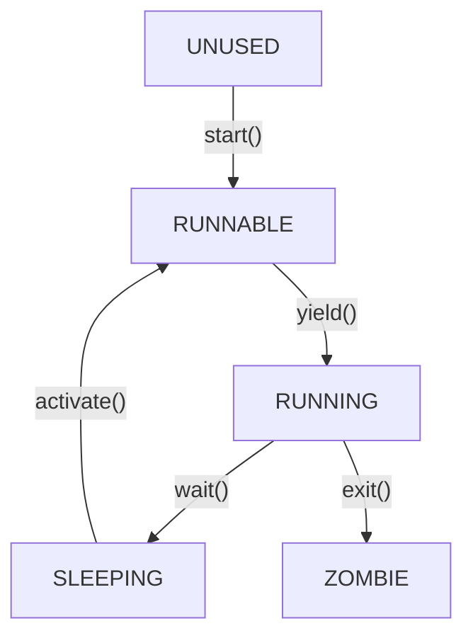
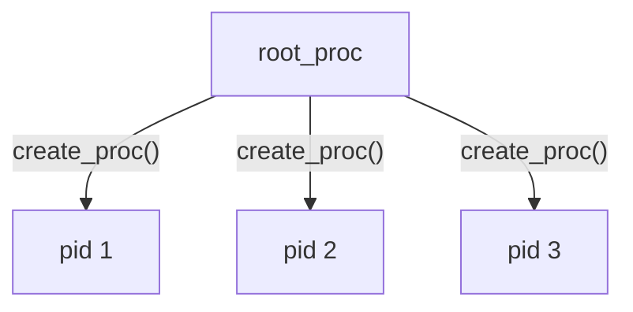

# Lab 2: Process (Kernel Part)

负责助教：[孔令宇](mailto:lykong22@m.fudan.edu.cn)

本实验中，我们将引入进程的概念，并实现如下的进程**状态转换**逻辑。



我们会先实现负责管理和调度进程的一系列内核库，然后创建一些简易的、运行在内核地址空间的进程。下一个实验，我们将结合页表，引入真正的、拥有独立地址空间的用户态进程。

## 1. 服务器操作

运行以下命令进行代码的拉取与合并

```shell
# 拉取远端仓库
git fetch --all

# 提交你的更改
git add .
git commit -m "your commit message"

# 切换到新lab的分支
git checkout lab2

# 新建一个分支，用于开发
git checkout -b lab2-dev

# 引入你在上个lab的更改
git merge lab1-dev
```

如果合并发生冲突，请参考错误信息自行解决。

## 2. 进程 Process

为了使多个程序“轮流”使用处理器资源，操作系统引入了进程的概念。进程在操作系统中串连成一个树状结构，其中每个节点可以通过 `create_proc` 创建子进程，使用 `start_proc` 启动子进程，当子进程 `exit` 退出后，父进程会负责管理并回收子进程的资源，并且获取子进程退出的状态 `exitcode`。

举例如下图所示，根节点为 `root_proc`。



在本实验内核中，我们使用 `Proc` 来表示一个进程。`Proc` 中包含了该进程相关的所有控制信息，具体定义在 `kernel/proc.h` 中。

```c
typedef struct Proc {
    bool killed;
    bool idle;
    int pid;
    int exitcode;
    enum procstate state;
    Semaphore childexit;
    ListNode children;
    ListNode ptnode;
    struct Proc *parent;
    struct schinfo schinfo;
    void *kstack;
    UserContext *ucontext;
    KernelContext *kcontext;
} Proc;
```

* `killed`： 我们在下一个实验中会引入 killed 的概念，本实验中不涉及。
* `idle`： 标记进程是否为 `idle` 进程。
* `pid`：进程唯一标记 pid，进程树中存在的所有进程的 pid 不能重复。
* `exitcode`：进程的退出代码，在退出时设置，代表退出时的状态。将会传递给父进程。
* `state`：进程所处的**状态**，包括 UNUSED, RUNNABLE, RUNNING, SLEEPING, ZOMBIE 五种。
* `childexit` ：进程退出的**信号量**，用于提示子进程退出，唤醒 SLEEPING 状态的父进程以回收子进程。
* `children`：进程所有子进程的链表。
* `ptnode`：进程作为子进程时，串在父进程的`children`链表上的节点。
* `parent`：指向父进程的指针
* `schinfo`：调度信息
* `kstack`：内核程序运行时使用的栈
* `ucontext`：用户态上下文，用于保存用户态的寄存器信息，也称作 `trap frame`
* `kcontext`：内核态上下文，用于保存内核态的寄存器信息。


**思考**：内核态上下文切换时，有哪些寄存器是一定要保存的？


进程退出时，将其子进程的父进程改为 `root_proc`。确保除了 root 的进程都有父进程，也就是所有的进程能够构成一棵树。

多核会并发地操作进程树，因此需要锁来保护这些操作。简单起见，我们建议直接使用全局的进程树锁（如果你感兴趣也可以尝试更细粒度的锁，但是按照往年的经验，调通并且不出并发问题是很困难的）。

## 3. 调度器 Scheduler

内核希望把计算时间分给不同的进程，并发执行：

* 当前台进程暂停等待时（例如等待磁盘资源、等待子进程退出等）时，可以先暂时挂起，让其他的进程继续执行。
* 用户进程发生时钟中断，提示时间片结束时，需要换另一个进程上来运行（本次实验暂时不需要）。

因此操作系统引入了**调度器**的概念。


**注意:** 在我们的实验中，并不存在一个具体的调度器对象，调度器是由 `sched.c` 中的所有全局变量和函数一起组成的。


调度器维护 CPU 和进程的调度信息，在进程请求调度时决定下一个运行什么进程，并执行进程切换。进程切换需要更新相关的调度信息，并进行上下文切换。

一般情况下，调度器会为处于 `RUNNING` 和 `RUNNABLE` 状态的进程维护一个调度队列（也可能为每个CPU分别维护一个队列，我们统称调度队列）。当进程状态更改为 `SLEEPING` 或者 `ZOMBIE` 时，将被从调度队列中移除。当`UNUSED`或`SLEEPING`状态的进程被激活（`activate_proc`）时，将被加入调度队列。

每个CPU都有一个专属的 idle 进程。idle 进程不进入调度队列，或进入调度队列但优先级永远最低。当没有其他进程可以调度时，调度器将选择 idle 进程，保证CPU上总有进程可以运行。

此外，调度队列可能需要锁来同步。

设计调度算法时，请注意考虑负载均衡和公平调度问题。在 Lab 2 中，我们只要求调度算法不要过于离谱即可。但你可以提前思考一下，Lab 3 中有了复杂的用户进程之后，如何设计你的调度算法？

## 4. 进程生命周期

本段将带大家过一遍进程的从创建到退出的整个流程。


涉及的具体理论知识请参考elearning上进程相关理论课内容。


当一段内核代码需要创建一个进程时，首先它应该处于init阶段之后，因为init阶段才完成进程树和调度器的初始化。

要创建进程的内核代码首先调用`create_proc`，分配空间并初始化进程结构体。此时进程处于`UNUSED`状态。

在进程启动之前，还可以对进程结构体的一些内容进行修改，如修改其父进程，修改其调度信息，修改初始寄存器值等。


**思考**：一般情况下，只能选择`root_proc`和当前进程为新进程的父进程，为什么？


随后调用`start_proc`启动进程。启动进程时，将为进程设置入口函数，并将其加入调度队列，状态更新为`RUNNABLE`。此时进程已经可以被调度。

进程被调度后，进入指定的进程入口函数，执行进程代码。


**思考**：真正的入口函数是`proc_entry`，然后才进入指定的入口函数，为什么要这样设计？


进程可以调用`wait`、`wait_sem`等函数，这些函数会在条件不满足时令进程陷入`SLEEPING`状态等待。它们都是通过配置好相关信息后调用`sched(SLEEPING)`实现的。


**思考**：直接调用`sched(SLEEPING)`会怎么样？


其他进程可以通过调用`activate_proc`唤醒处于`SLEEPING`状态的进程，这会将进程的状态更改为`RUNNABLE`并加入调度队列。

进程执行完毕后，应调用`exit`退出。`exit`将释放一些资源，将子进程全部转移给`root_proc`，然后调用`sched(ZOMBIE)`。此时进程处于`ZOMBIE`状态，不再执行，只保留一些基础的数据等待父进程在`wait`中回收。


**思考**：进程执行完毕后，直接`return`而不`exit`会怎样？


进程的父进程可以调用`wait`释放`ZOMBIE`状态子进程的剩余资源，并释放进程结构体。`wait`将向父进程反馈子进程的退出代码和 PID 。

## 5. Trap

这里有三个概念需要了解：中断（Interrupt）、异常（Exception）、陷入（Trap）。如果你上过计组（H），你应该已经很熟悉了。

* **中断**（Interrupt）：是指处理器接收到来自硬件或软件的信号，提示发生了某个事件，应该被注意，转而去执行相应的处理程序的过程。本质是终止当前运行的程序，执行一段其他的处理程序。
* **异常**（Exception）：是指程序运行时发生错误，例如除 0 或者读取非法内存地址时发生的中断。
* **陷入**（Trap）：一般指由于软件指令，例如系统调用，使得用户态程序中断，进入内核态执行一些任务。也指在中断发生时，保存用户寄存器、执行特殊处理程序、恢复用户寄存器的过程。


事实上，不同平台（如x86-64，AArch64，RISC-V）对于以上三个概念的定义不甚相同，很多情况下甚至交替使用。


通过配置相关寄存器，我们将所有 trap 的入口设定为 `trap_entry`。`trap_entry` 中需要保存 trap 的上下文，并调用 `trap_global_handler`。

`trap_global_handler` 会根据 trap 的类型进行相应的处理。本 lab 中，我们只启用了时钟中断，并且对于时钟中断不做处理直接返回。（即只要求大家正确书写基础代码，不实现具体功能）

在内核态，我们关闭了时钟中断，只有 `idle_entry` 中等待 event 时打开。

## 6. 提示

### 6.1 信号量 Semaphore

**信号量**是操作系统解决并发中的互斥、同步问题的一种重要方法，基于信号量我们可以实现进程的 SLEEPING ，等待子进程唤醒等功能。


具体的实现可以参考 `src/common/sem.h` 和 `src/common/sem.c`


信号量维护了一个值 val 以及一个等待队列 sleeplist。val 提示此信号量的资源量，对于信号量的操作上分为P、V操作（对应wait、post）。通俗的理解post是生产、wait是消费

* `wait_sem`：val --，消费一份资源，当 val = 0 时，此进程会被进入 SLEEPING 阶段，并且挂在 sleeplist 上。
* `post_sem`：val ++，生产一份资源，此时 SLEEPING 阶段的进程会被唤醒。

当 val 的值初始化 = 0 时，可以做到等待子进程唤醒的功能。而当 val 的值初始化 = 1 时，可以做到类似锁的效果。

## 6.2 其他提示

* 时钟中断相关的可以先忽略，应该不影响测试，下一个实验进行细节补充。
* [虎鲸视频](https://www.bilibili.com/video/BV1tV4y1N7aP)

## 7. 任务

* `aarch64/swtch.S: swtch`
* `aarch64/trap.S: trap_entry trap_return`
* `kernel/proc.c: init_kproc init_proc set_parent_to_this start_proc wait exit`
* `kernel/proc.h: UserContext KernelContext schinfo`
* `kernel/sched.c: thisproc init_schinfo acquire_sched_lock release_sched_lock activate_proc sched(update_this_state pick_next update_this_proc)`
* `kernel/cpu.h: sched`

我们已经在 kernel\_entry 中编写了调用 proc\_test 的代码。如果一切顺利，将输出 proc\_test PASS。之后会有三个CPU 弹出 Living 的提示，因为收到了时钟中断的信号。

## 6. 提交

**提交方式**：将实验报告提交到 elearning 上，格式为`学号-lab2.pdf`。

**截止时间**：**10月23日23:59**

> [!danger]
>
> **逾期提交将扣除部分分数**
>
> 计算方式为 $\text{score}_{\text{final}} = \text{score} \cdot \left(1 - n \cdot 20\% \right)$，其中 $n$ 为迟交天数，不满一天按一天计算）。

报告中可以包括下面内容

* 代码运行效果展示
* 实现思路和创新点
* 对后续实验的建议
* 其他任何你想写的内容 (~~你甚至可以再放一只可爱猫猫~~)

报告中不应有大段代码的复制。如有使用本地环境进行实验的同学，请联系助教提交代码（提供 `git` 仓库）。使用服务器进行实验的同学，助教将在服务器上检查，无需另外提交代码。

> [!important]
>
> **提交操作**：
>
> ```shell
> # 提交最后的代码
> git add .
> git commit -m "your final commit message"
> ```
>
> 从本次实验开始，我们会在**不晚于你提交实验报告时间**的最后一次 commit 上批改你的代码，如果你有新的 commit，请在 elearning 上重新提交实验报告。
